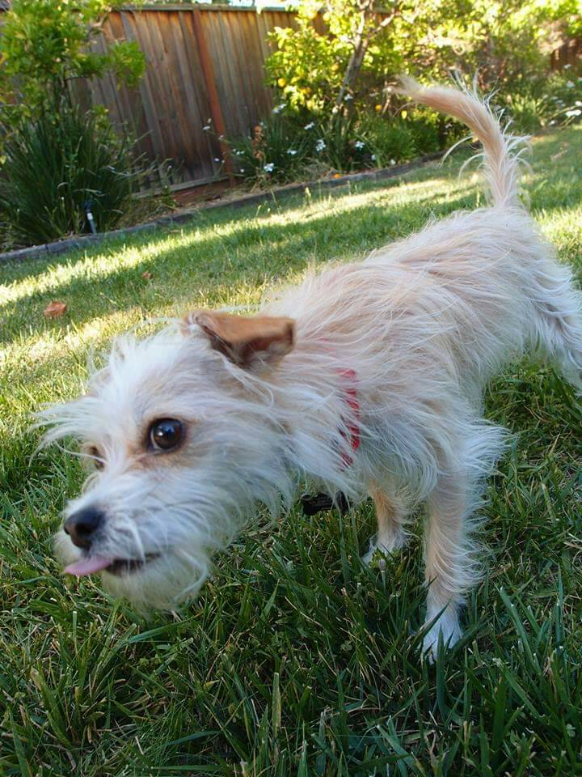

## Header: Two number signs + 1 space

#### Sub-header: More number signs = smaller header

###### subsubsub header

## Python 101 Lesson 2
### March 19, 2019

###### *Italic = 1 asterick*
###### __Bold = 2 underlines__
###### *__Test__* *Test*

